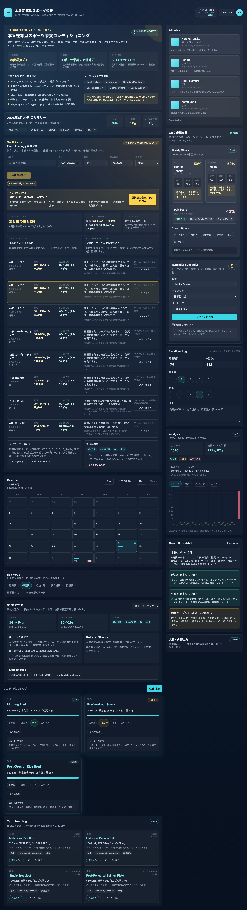
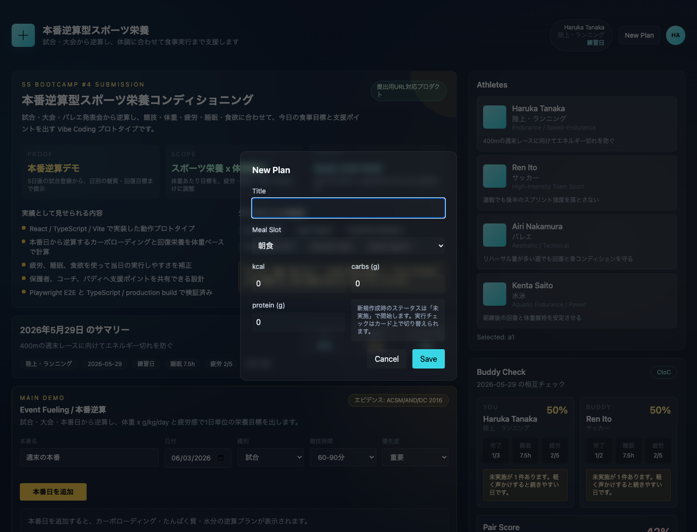

# Athlete Nutrition App

試合日、練習日、体調に合わせて、アスリートの食事計画と実行記録を1画面で回すコンディショニングアプリです。

このプロトタイプは、単なる献立管理ではなく「計画した食事を実際に食べられたか」「睡眠や疲労と食事がどう関係しているか」「保護者やコーチへ何を共有すべきか」まで扱うことを目的にしています。

## Documentation

仕様書、使い方、活用方法は [APP_SPEC_AND_USER_GUIDE.md](APP_SPEC_AND_USER_GUIDE.md) にまとめています。

## Demo Value

- 競技ごとの栄養ターゲットを見ながら食事プランを作成できます。
- 食事ごとに `未実施 / 一部だけ / 完了 / スキップ` を記録できます。
- 睡眠、疲労、食欲、体重、メモを日別に保存できます。
- ルールベースの AI Coach Notes が、食事実行率や体調に応じた改善コメントを返します。
- 保護者やコーチへ送る共有メモをその場で生成し、コピーできます。
- localStorage の破損や旧形式データにも配慮し、日付単位のログとして扱います。

## Screenshots





## Features

- `Daily Log`: 日付ごとに食事プラン、体調ログ、Day Mode を分離保存
- `Calendar`: 月間カレンダーで記録済みの日、Day Mode、完了率を確認
- `Day Mode`: 通常日 / 練習日 / 試合前日 / 試合当日 / 回復日を切り替え
- `Sport Profile`: 陸上、野球、サッカー、バレエ、バスケットボール、ゴルフ、水泳、卓球に対応
- `Event Fueling`: 試合・大会・本番日から逆算し、カーボローディングと回復栄養を日別に計算
- `Plan Execution`: 各食事プランの実行状態を記録
- `Meal Photo`: 食事カードに写真を添付し、日別ログに保存
- `Buddy Check`: 選手同士で当日の実行率、未実施数、睡眠、疲労を相互確認
- `Pair Score`: バディとの直近7日平均実行率と連続達成日数を表示
- `Cheer Stamps`: 「ナイス補食」「水分OK」などの応援スタンプで継続を支援
- `Team Food Log`: チームメイトの食事ログを見て、自分のプランに取り込める
- `Reminder Scheduler`: 補食、水分、回復の声かけを自分やバディに予約
- `Condition Log`: 睡眠時間、疲労感、食欲、体重、メモを記録
- `AI Coach Notes`: 体調と食事ログから簡易コーチングコメントを表示
- `Convenience Suggestions`: 食事ごとのコンビニ代替案を表示
- `Guardian Share Mode`: 保護者やコーチ向けの共有テキストを生成

## Why This Is Different

既存の食事管理アプリは、カロリーや栄養素の入力に寄りがちです。このアプリでは、学生アスリートや競技者が実際に困る場面に寄せています。

- 試合前日、試合当日、回復日で見るべき栄養指標が変わる
- 忙しい日や移動中は、理想の献立より実行できる代替案が重要
- コーチや保護者は、細かい入力値より「今日何を支援すべきか」を知りたい
- 食事計画は、睡眠、疲労、食欲と合わせて見ないと継続改善につながりにくい

## Tech Stack

- React
- TypeScript
- Vite
- Tailwind CSS
- Chart.js / react-chartjs-2
- Playwright
- localStorage

## Run Locally

```bash
npm install
npm run dev
```

Build:

```bash
npm run build
```

After build, `dist/index.html` can also be opened directly from Finder.

## Verification

The current implementation has been checked with:

```bash
npx tsc --noEmit
npm run build
node e2e-temp/verify2.mjs
node e2e-temp/verify3.mjs
node e2e-temp/focus-photo.mjs
node e2e-temp/content-verify.mjs
node e2e-temp/five-athlete-30day-verify.mjs
node e2e-temp/event-fueling-verify.mjs
```

Latest verification result:

```text
npx tsc --noEmit: PASS
npm run build: PASS
verify2: PASS=10 / FAIL=0 / WARN=0
verify3: PASS=14 / FAIL=0 / WARN=0
focus-photo: PASS
content-verify: PASS=12 / FAIL=0
five-athlete-30day-verify: PASS=71 / FAIL=0
event-fueling-verify: PASS=19 / FAIL=0 / WARN=0
```

The E2E check includes:

- New plan creation
- Numeric validation and NaN guard
- ID collision check
- Broken `athleteId` handling
- Broken localStorage preservation
- Condition Log input stability
- Event Fueling form creation
- Competition countdown
- Carbohydrate-loading and g/kg text
- localStorage event persistence

## Data Storage

This prototype uses browser localStorage.

- `plans`: meal plans with athlete id and date
- meal photos are stored as compressed thumbnail data inside each plan
- `athletes`: athlete profiles and selected sport
- `athlete-checkins`: condition logs by athlete and date
- `athlete-day-modes`: day mode by athlete and date
- `athlete-events`: competition and performance dates for event fueling
- `selected-athlete-id`: last selected athlete
- `ctoc-reminders`: CtoC reminder reservations

If stored data is malformed, the app avoids overwriting it silently. Invalid data is kept or backed up so that recovery remains possible.

## Evidence Basis

The nutrition targets are simplified prototype values based on body-weight-based carbohydrate and protein ranges, adapted by sport, day mode, event duration, and condition logs. Event Fueling uses body weight, fatigue, sleep, appetite, and the number of days until competition to adjust daily targets. The app refers to sports nutrition guidance and review literature such as:

- Academy of Nutrition and Dietetics / ACSM / Dietitians of Canada: Nutrition and Athletic Performance
- International Society of Sports Nutrition: Protein and Exercise
- Soccer nutrition review
- Swimming nutrition review
- Basketball recovery review
- Dancer energy status review
- Golf nutrition review
- Table tennis nutrition review

For competition week, the app uses the ACSM/AND/Dietitians of Canada position paper as a base: moderate to high training days use body-weight carbohydrate targets, long events can trigger 7-12 g/kg/day carbohydrate-loading guidance, and recovery days emphasize carbohydrate plus protein and hydration. Fatigue, short sleep, and low appetite are treated as practical modifiers rather than medical diagnoses.

The values shown in this app are for education and prototyping. Real athlete support requires individual assessment by qualified professionals.

## Main Files

- [src/App.tsx](src/App.tsx)
- [src/pages/Home.tsx](src/pages/Home.tsx)
- [src/context/AthleteContext.tsx](src/context/AthleteContext.tsx)
- [src/lib/appModel.ts](src/lib/appModel.ts)
- [src/lib/date.ts](src/lib/date.ts)
- [src/components/NutritionCard.tsx](src/components/NutritionCard.tsx)
- [src/components/CheckinPanel.tsx](src/components/CheckinPanel.tsx)
- [src/components/AiCoachPanel.tsx](src/components/AiCoachPanel.tsx)
- [src/components/SharePanel.tsx](src/components/SharePanel.tsx)
